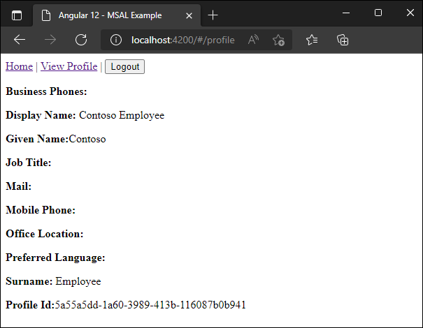

<!-- Keeping yaml frontmatter commented out for now
---
# Metadata required by https://docs.microsoft.com/samples/browse/
# Metadata properties: https://review.docs.microsoft.com/help/contribute/samples/process/onboarding?branch=main#add-metadata-to-readme
languages:
- Javascript
page_type: sample
name: "Angular Single Page Application (SPA) that accesses Graph"
description: "This Angular Single Page Application (SPA) accesses a protected route and makes a call to the Graph API as the user."
products:
- azure
- azure-active-directory
- ms-graph
urlFragment: ms-identity-docs-javascript-angular-spa
---
-->
<!-- SAMPLE ID: DOCS-CODE-022 -->
# Angular | web | user sign-in, protected web API access (Microsoft Graph) | Microsoft identity platform

<!-- Build badges here
  
-->

This Angular application uses the Angular MSAL v2 library to authenticate a user and then makes a request to the Graph API as the authenticated user. The response to the request is displayed in the web browser.



## Prerequisites

- Azure Active Directory (Azure AD) tenant and the permissions or role required for managing app registrations in the tenant.
- Node.js 16+
- Angular 12

## Setup

### 1. Register the app

First, complete the steps in [Register an application with the Microsoft identity platform](https://docs.microsoft.com/azure/active-directory/develop/quickstart-register-app) to register the application.

Use these settings in your app registration.

| App registration <br/> setting    | Value for this sample app                                                    | Notes                                                                                              |
|---------------------------------:|:-----------------------------------------------------------------------------|:---------------------------------------------------------------------------------------------------|
| **Name**                          | `Angular SPA`                                                                | Suggested value for this sample. <br/> You can change the app name at any time.                    |
| **Supported account types**       | **Accounts in this organizational directory only (Single tenant)**           | Suggested value for this sample.                                                                   |
| **Platform type**                 | Single-Page Application                                                      | Required value for this sample.                                                 |
| **Redirect URI**                  | `http://localhost:4200`                                                      | Required value for this sample.                                                                    |

> :information_source: **Bold text** in the tables above matches (or is similar to) a UI element in the Azure portal, while `code formatting` indicates a value you enter into a text box in the Azure portal.

### 2. Update code sample in _app.module.ts_ with app registration values

```javascript
// 'Application (client) ID' of app registration in Azure portal - this value is a GUID
clientId: '',

// Full directory URL, in the form of https://login.microsoftonline.com/<tenant>
authority: '',

// Must be the same redirectUri as what was provided in your AD app registration.
redirectUri: ''
```

### 3. Install package(s)

To install required packages:

```console
npm install
```

## Run the application

```console
ng serve --open
```

Follow the instructions that are presented on the web browser. If everything worked, you should receive a response similar to this on the "View Profile" page:


## About the code

This Angular web application uses the Angular MSAL v2 library to authenticate a user and then makes a request to the Microsoft Graph API as the authenticated user to retrieve their user profile data.
- MSALGuard is used to protect the web app's routes.
- MSALBroadcastService is used to consume events emitted by MSAL.  Events such as "login success" and "acquire token success" tell the app when the user has sucessfully been authenticated.
- MSALInterceptor is an Interceptor clsss provided by MSAL Angular to automatically and silently acquire access tokens for known resources, in this case for Graph.
- HttpClient is used to issue an HTTP GET request to Microsoft Graph with user's access token.

## Reporting problems

### Sample app not working?

If you can't get the sample working, you've checked [Stack Overflow](http://stackoverflow.com/questions/tagged/msal), and you've already searched the issues in this sample's repository, open an issue report the problem.

1. Search the [GitHub issues](../../issues) in the repository - your problem might already have been reported or have an answer.
1. Nothing similar? [Open an issue](../../issues/new) that clearly explains the problem you're having running the sample app.

### All other issues

> :warning: WARNING: Any issue in this repository _not_ limited to running one of its sample apps will be closed without being addressed.

For all other requests, see [Support and help options for developers | Microsoft identity platform](https://docs.microsoft.com/azure/active-directory/develop/developer-support-help-options).

## Contributing

If you'd like to contribute to this sample, see [CONTRIBUTING.MD](/CONTRIBUTING.md).

This project has adopted the [Microsoft Open Source Code of Conduct](https://opensource.microsoft.com/codeofconduct/). For more information, see the [Code of Conduct FAQ](https://opensource.microsoft.com/codeofconduct/faq/) or contact [opencode@microsoft.com](mailto:opencode@microsoft.com) with any additional questions or comments.
