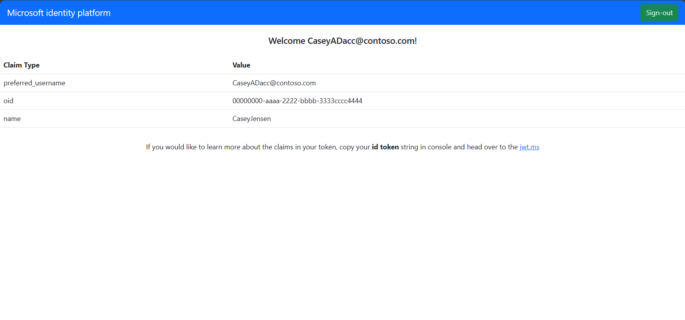

# Vanilla JavaScript single-page application using MSAL.js to authenticate users with Microsoft Entra ID

* [Overview](#overview)
* [Usage](#usage)
* [Contents](#contents)
* [Prerequisites](#prerequisites)
* [Explore the sample](#explore-the-sample)
* [Troubleshooting](#troubleshooting)
* [About the code](#about-the-code)
* [Contributing](#contributing)
* [Learn More](#learn-more)

## Overview

This sample demonstrates how to sign users into a sample Vanilla JavaScript single-page application (SPA) tby using Microsoft Entra ID. The sample utilizes the [Microsoft Authentication Library for JavaScript](https://github.com/AzureAD/microsoft-authentication-library-for-js) (MSAL.js) to simplify adding authentication.

## Usage

| Instruction                  |                Description                  |
|------------------------------|---------------------------------------------|
| **Use case**                 | Authenticate users and call a protected web API. |
| **Scenario**                 | Sign in users. You acquire an ID token by using authorization code flow with PKCE. |
| **Add sign in to your app**  | Use the instructions in [Sign in users in a single-page app (SPA) and call the Microsoft Graph API using JavaScript](https://learn.microsoft.com/entra/identity-platform/quickstart-single-page-app-javascript-sign-in) to learn how to add sign in to your JavaScript SPA. |
| **Product documentation**    | Explore [Microsoft Entra ID for customers documentation](https://learn.microsoft.com/entra/external-id/customers/) |

## Contents

| File/folder              | Description                                                               |
|--------------------------|---------------------------------------------------------------------------|
| `public/authConfig.js`   | Contains configuration parameters for the sample.                         |
| `public/authPopup.js`    | Main authentication logic resides here (using popup flow).                |
| `public/authRedirect.js` | Use this instead of `authPopup.js` for authentication with redirect flow. |
| `public/ui.js`           | Contains UI logic.                                                        |
| `server.js`              | Node server for `index.html`.                                      |

## Prerequisites

* [Node.js](https://nodejs.org/en/download/) must be installed to run this sample.
* [Visual Studio Code](https://code.visualstudio.com/download) is recommended for running and editing this sample.
* A Microsoft Entra tenant. For more information, see: [How to get a Microsoft Entra tenant](https://learn.microsoft.com/entra/identity-platform/test-setup-environment#get-a-test-tenant)
* If you'd like to use Azure services, such as hosting your app in Azure App Service, [VS Code Azure Tools](https://marketplace.visualstudio.com/items?itemName=ms-vscode.vscode-node-azure-pack) extension is recommended for interacting with Azure through VS Code Interface.

>This sample will not work with a **personal Microsoft account**. If you're signed in to the [Microsoft Entra admin center](https://entra.microsoft.com/) with a personal Microsoft account and have not created a user account in your directory before, you will need to create one before proceeding.

## Clone or download the sample application

To obtain the sample application, you can either clone it from GitHub or download it as a .zip file.

* To clone the sample, open a command prompt and navigate to where you wish to create the project, and enter the following command:

    ```console
    git clone https://github.com/Azure-Samples/ms-identity-docs-code-javascript
    ```

* [Download the .zip file](https://github.com/Azure-Samples/ms-identity-docs-code-javascript/archive/refs/heads/main.zip). Extract it to a file path where the length of the name is fewer than 260 characters.

## Register the SPA in your tenant

You can register an app in your tenant automatically by using Microsoft Graph PowerShell or via the Microsoft Entra Admin center.

When you use Microsoft Graph PowerShell, you automatically register the applications and related objects app secrets, then modify your project config files, so you can run the app without any further action:

* To register your app in the Microsoft Entra admin center use the steps in [Register the web app](https://learn.microsoft.com/entra/external-id/customers/sample-web-app-node-sign-in#register-the-web-app).

* To register and configure your app automatically,

    <details>
        <summary>Expand this section</summary>
    
    > :warning: If you have never used **Microsoft Graph PowerShell** before, we recommend you go through the [App Creation Scripts Guide](./AppCreationScripts/AppCreationScripts.md) once to ensure that you've prepared your environment correctly for this step.
    
    1. Ensure that you have PowerShell 7 or later installed.
    1. Run the script to create your Microsoft Entra ID application and configure the code of the sample application accordingly.
    1. For interactive process in PowerShell, run:
    
        ```PowerShell
        cd .\AppCreationScripts\
        .\Configure.ps1 -TenantId "[Optional] - your tenant id" -AzureEnvironmentName "[Optional] - Azure environment, defaults to 'Global'"
        ```
    
    > Other ways of running the scripts are described in [App Creation Scripts guide](./AppCreationScripts/AppCreationScripts.md). The scripts also provides a guide to automated application registration, configuration and removal which can help in your CI/CD scenarios.
    
    > :exclamation: NOTE: This sample can make use of client certificates. You can use **AppCreationScripts** to register an Microsoft Entra ID application with certificates. For more information see, [Use client certificate for authentication in your Node.js web app instead of client secrets](https://review.learn.microsoft.com/entra/external-id/customers/how-to-web-app-node-use-certificate).
    
    </details>

## Configure the project

1. Open the project folder, *ms-identity-javascript-tutorial*, containing the sample.
1. Open *1-Authentication/1-sign-in/App/authConfig.js* and update the following values with the information recorded earlier in the admin center.

    * `clientId` - The identifier of the application, also referred to as the client. Replace the text in quotes with the **Application (client) ID** value that was recorded earlier.
    * `authority` - The authority is a URL that indicates a directory that MSAL can request tokens from. Replace *Enter_the_Tenant_Info_Here* with the **Directory (tenant) ID** value that was recorded earlier.
    * `redirectUri` - The **Redirect URI** of the application. If necessary, replace the text in quotes with the redirect URI that was recorded earlier.

## Run the application and sign in

Run the project with a web server by using Node.js:

1. To start the server, run the following commands from within the project directory:

    ```console
    npm install
    npm start
    ```

## Explore the sample

1. Open your browser and navigate to `http://localhost:3000`.
1. Click the **sign-in** button on the top right corner.



> :information_source: Did the sample not work for you as expected? Then please reach out to us using the [GitHub Issues](../../../../issues) page.

## We'd love your feedback

Were we successful in addressing your learning objective? Consider taking a moment to [share your experience with us](https://forms.office.com/Pages/ResponsePage.aspx?id=v4j5cvGGr0GRqy180BHbR73pcsbpbxNJuZCMKN0lURpUNDVHTkg2VVhWMTNYUTZEM05YS1hSN01EOSQlQCN0PWcu).

## Troubleshooting

<details>
	<summary>Expand for troubleshooting info</summary>

Use [Stack Overflow](http://stackoverflow.com/questions/tagged/msal) to get support from the community. Ask your questions on Stack Overflow first and browse existing issues to see if someone has asked your question before.
Make sure that your questions or comments are tagged with [`azure-active-directory` `ms-identity` `adal` `msal`].

</details>

## About the code

## Sign-in

MSAL.js provides 3 login APIs: `loginPopup()`, `loginRedirect()` and `ssoSilent()`:

```javascript
    myMSALObj.loginPopup(loginRequest)
        .then((response) => {
            // your logic
        })
        .catch(error => {
            console.error(error);
        });
```

To use the redirect flow, you must register a handler for redirect promise. **MSAL.js** provides`handleRedirectPromise()` API:

```javascript
    myMSALObj.handleRedirectPromise()
        .then((response) => {
            // your logic
        })
        .catch(err => {
            console.error(err);
        });

    myMSALObj.loginRedirect(loginRequest);
```

The recommended pattern is that you fallback to an **interactive method** should the silent SSO fails.

```javascript

    const silentRequest = {
      scopes: ["openid", "profile"],
      loginHint: "example@domain.net"
    };

    myMSALObj.ssoSilent(silentRequest)
        .then((response) => {
            // your logic
        }).catch(error => {
            console.error("Silent Error: " + error);
            if (error instanceof msal.InteractionRequiredAuthError) {
                myMSALObj.loginRedirect(loginRequest);
            }
        });
```

You can get all the active accounts of a user with the get `getAllAccounts()` API. If you know the **username** or **home ID** of an account, you can select it by:

```javascript
    myMSALObj.getAccountByUsername(username);
    // or
    myMSALObj.getAccountByHomeId(homeId);
```

### Sign-out

The Application redirects the user to the **Microsoft identity platform** logout endpoint to sign out. This endpoint clears the user's session from the browser. If your app did not go to the logout endpoint, the user may re-authenticate to your app without entering their credentials again, because they would have a valid single sign-in session with the **Microsoft identity platform** endpoint. For more, see: [Send a sign-out request](https://learn.microsoft.com/azure/active-directory/develop/v2-protocols-oidc#send-a-sign-out-request)

### ID Token Validation

A single-page application does not benefit from validating ID tokens, since the application runs without a back-end and as such, attackers can intercept and edit the keys used for validation of the token.

### Sign-in Audience and Account Types

This sample is meant to work with accounts in your organization (aka *single-tenant*). If you would like to allow sign-ins with other type accounts, you have to configure your `authority` string in `authConfig.js` accordingly. For example:

```javascript
const msalConfig = {
    auth: {
      clientId: 'Enter_the_Application_Id_Here', // This is the ONLY mandatory field that you need to supply.
      authority: 'https://login.microsoftonline.com/Enter_the_Tenant_Info_Here', 
      redirectUri: 'Enter_the_Redirect_URI_Here/',
    },
```

For more information about audiences and account types, please see: [Validation differences by supported account types (signInAudience)](https://learn.microsoft.com/azure/active-directory/develop/supported-accounts-validation)

> :warning: Be aware that making an application multi-tenant entails more than just modifying the `authority` string. For more information, please see [How to: Sign in any Microsoft Entra user using the multi-tenant application pattern](https://learn.microsoft.com/azure/active-directory/develop/howto-convert-app-to-be-multi-tenant).

### Authentication in National Clouds

National clouds (aka Sovereign clouds) are physically isolated instances of Azure. These regions of Azure are designed to make sure that data residency, sovereignty, and compliance requirements are honored within geographical boundaries. Enabling your application for sovereign clouds requires you to:

* register your application in a specific portal, depending on the cloud.
* use a specific authority, depending on the cloud in the configuration file for your application.
* in case you want to call the MS Graph, this requires a specific Graph endpoint URL, depending on the cloud.

See [National Clouds](https://learn.microsoft.com/azure/active-directory/develop/authentication-national-cloud#app-registration-endpoints) for more information.

## Contributing

If you'd like to contribute to this sample, see [CONTRIBUTING.MD](/CONTRIBUTING.md).

This project has adopted the [Microsoft Open Source Code of Conduct](https://opensource.microsoft.com/codeofconduct/). For more information, see the [Code of Conduct FAQ](https://opensource.microsoft.com/codeofconduct/faq/) or contact [opencode@microsoft.com](mailto:opencode@microsoft.com) with any additional questions or comments.

## Learn More

* [Microsoft identity platform](https://learn.microsoft.com/azure/active-directory/develop/)
* [Microsoft Entra code samples](https://learn.microsoft.com/azure/active-directory/develop/sample-v2-code)
* [Overview of Microsoft Authentication Library (MSAL)](https://learn.microsoft.com/azure/active-directory/develop/msal-overview)
* [Configure a client application to access web APIs](https://learn.microsoft.com/azure/active-directory/develop/quickstart-configure-app-access-web-apis)
* [Understanding Microsoft Entra application consent experiences](https://learn.microsoft.com/azure/active-directory/develop/application-consent-experience)
* [Understand user and admin consent](https://learn.microsoft.com/azure/active-directory/develop/howto-convert-app-to-be-multi-tenant#understand-user-and-admin-consent)
* [Application and service principal objects in Microsoft Entra](https://learn.microsoft.com/azure/active-directory/develop/app-objects-and-service-principals)
* [Authentication Scenarios for Microsoft Entra](https://learn.microsoft.com/azure/active-directory/develop/authentication-flows-app-scenarios)
* [Building Zero Trust ready apps](https://aka.ms/ztdevsession)
* [National Clouds](https://learn.microsoft.com/azure/active-directory/develop/authentication-national-cloud#app-registration-endpoints)
* [Initialize client applications using MSAL.js](https://learn.microsoft.com/azure/active-directory/develop/msal-js-initializing-client-applications)
* [Single sign-on with MSAL.js](https://learn.microsoft.com/azure/active-directory/develop/msal-js-sso)
* [Handle MSAL.js exceptions and errors](https://learn.microsoft.com/azure/active-directory/develop/msal-handling-exceptions?tabs=javascript)
* [Logging in MSAL.js applications](https://learn.microsoft.com/azure/active-directory/develop/msal-logging?tabs=javascript)
* [Pass custom state in authentication requests using MSAL.js](https://learn.microsoft.com/azure/active-directory/develop/msal-js-pass-custom-state-authentication-request)
* [Prompt behavior in MSAL.js interactive requests](https://learn.microsoft.com/azure/active-directory/develop/msal-js-prompt-behavior)
* [Use MSAL.js to work with Azure AD B2C](https://learn.microsoft.com/azure/active-directory/develop/msal-b2c-overview)
